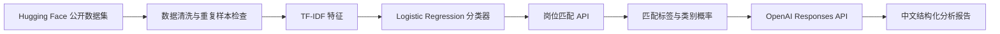

# ResumeAI-Agent

> 一个面向作品集的端到端 AI 项目：将英文简历与岗位描述输入系统，输出三档岗位匹配结果、可解释的分类概率，以及由 LLM 生成的中文改进建议。

> [!WARNING]
> 本项目仅用于学习、研究和作品集演示。模型输出不是录用概率，不能用于自动化淘汰、录用或其他招聘决定，必须由人类招聘人员复核。

## 项目简介

招聘场景中，简历与岗位描述（Job Description，JD）通常都是非结构化长文本。本项目将两段文本转换为可被模型理解的特征，并构建完整链路：数据下载、清洗与泄露检查、模型训练与对比、FastAPI 在线服务，以及 LLM 结构化分析报告。

当前部署的分类模型为 **TF-IDF + Logistic Regression**。它在最终独立测试集上取得 **0.6202 Macro-F1**，优于本项目当前的 Sentence Transformer 对比模型，因此被选为线上推理模型。

## 核心能力

- 输入简历文本和岗位描述，预测 `No Fit`、`Potential Fit`、`Good Fit` 三档匹配结果。
- 返回每一类别的模型置信度，支持前端或业务层展示。
- 使用 OpenAI Responses API 生成固定 JSON 结构的中文分析：总结、优势、差距与改进建议。
- 使用独立最终测试集评估，清洗阶段移除跨数据集重复样本，降低数据泄露风险。
- 使用 FastAPI 和自动生成的 Swagger 文档，支持本地交互式接口测试。

## 技术架构



| 层级 | 技术 | 作用 |
| --- | --- | --- |
| 数据 | Hugging Face Hub、pandas | 下载、解析和清洗简历—JD 配对数据 |
| NLP / ML | scikit-learn、TF-IDF、Logistic Regression | 建立可解释的三分类基线模型 |
| 语义对比 | Sentence Transformers、all-MiniLM-L6-v2 | 生成语义向量，与词面模型进行公平对比 |
| 服务 | FastAPI、Uvicorn、Pydantic | 提供校验严格的 HTTP API 与 Swagger 文档 |
| LLM | OpenAI Responses API、Structured Outputs | 生成符合固定结构的中文辅助分析 |
| 工程质量 | pytest、Ruff、Git | 自动化测试、代码检查和可追溯版本管理 |

## 项目结构

```text
ResumeAI-Agent/
├── data/                         # 原始数据和清洗后的数据（Git 忽略）
├── artifacts/                    # 模型、指标、嵌入缓存（Git 忽略）
├── docs/                         # 数据、模型、API 的详细说明
├── src/resumeai_agent/
│   ├── data/prepare_dataset.py   # 下载、清洗、去重和数据泄露检查
│   ├── models/                   # TF-IDF 基线与 Sentence Transformer 对比训练
│   ├── services/                 # 模型推理与 LLM 报告生成业务逻辑
│   └── api/                      # FastAPI 路由和请求/响应数据模型
├── tests/                        # 数据、训练、服务和 API 的自动化测试
├── .env.example                  # 环境变量模板，不含真实密钥
├── requirements.txt              # Python 依赖清单
└── pyproject.toml                # 项目与测试工具配置
```

这种分层使 API 路由只处理 HTTP 请求，`services` 只处理业务逻辑，`models` 专注训练；因此模型替换、单元测试和后续扩展不会相互缠绕。

## 数据集

- 数据集：[Resume-ATS Score Dataset v1 (English)](https://huggingface.co/datasets/0xnbk/resume-ats-score-v1-en)
- 许可证：Apache-2.0
- 原始规模：6,374 条英文简历—JD 配对样本
- 关键字段：`text`（由 `[SEP]` 分隔的简历和 JD）、`ats_score`（连续匹配分数）、`original_label`（三档标签）

数据清洗后，训练数据为 5,004 条，最终测试集为 1,270 条。清洗程序会移除缺失或格式错误记录、同一数据集内重复样本，以及训练集和测试集之间的完全重复配对。详细边界见 [数据源说明](docs/data_source.md)。

## 模型与评估

### 训练流程

1. 为简历与 JD 添加字段前缀并拼接，避免模型混淆两种文本角色。
2. 仅在内部训练集拟合 TF-IDF 向量器，提取 1–2 gram 词面特征。
3. 使用 `class_weight="balanced"` 的 Logistic Regression 学习三分类边界。
4. 使用固定随机种子和分层抽样建立内部验证集；官方验证集始终保留作最终测试，避免参数选择时“偷看答案”。

### 指标结果

| 模型 | 最终测试 Accuracy | 最终测试 Macro-F1 | 最终测试 Weighted-F1 | 结论 |
| --- | ---: | ---: | ---: | --- |
| TF-IDF + Logistic Regression | 0.6181 | **0.6202** | 0.6149 | 当前线上模型 |
| all-MiniLM-L6-v2 + One-vs-Rest Logistic Regression | 0.5630 | 0.5474 | 0.5701 | 对比模型，不上线 |

选择 Macro-F1 是因为它对每个类别的 F1 一视同仁，能避免样本较多的类别掩盖少数类别表现。完整实验条件、类别指标和结论见 [基线模型说明](docs/baseline_model.md) 与 [模型对比](docs/model_comparison.md)。

## 快速开始

### 1. 创建并激活虚拟环境

```powershell
python -m venv .venv
.\.venv\Scripts\Activate.ps1
```

虚拟环境将项目依赖与电脑全局 Python 隔离，避免版本冲突。

### 2. 安装依赖

```powershell
python -m pip install --upgrade pip
pip install -r requirements.txt
pip install -e .
```

### 3. 准备数据并训练模型

```powershell
python -m resumeai_agent.data.prepare_dataset
python -m resumeai_agent.models.train_baseline
```

模型文件会写入本地 `artifacts/models/`，而不是提交到 Git 仓库。这样可以避免二进制大文件让代码仓库膨胀。

### 4. 配置 LLM（可选）

```powershell
Copy-Item .env.example .env
```

在 `.env` 中填写自己的 `OPENAI_API_KEY`。`.env` 已被 `.gitignore` 排除；不要把 API Key 提交到 GitHub，也不要发送给他人。

### 5. 启动 API

```powershell
python -m uvicorn resumeai_agent.api.main:app --reload
```

浏览器访问 [http://127.0.0.1:8000/docs](http://127.0.0.1:8000/docs)，打开 Swagger UI 后可直接点击 **Try it out** 测试接口。

## API 示例

### 健康检查

`GET /health`：确认服务和本地模型已正常加载。

### 本地匹配预测

`POST /api/v1/match`

```json
{
  "resume_text": "Python developer with FastAPI, pandas, and REST API experience.",
  "job_description_text": "Backend engineer role requiring Python, FastAPI, and API development skills."
}
```

```json
{
  "label": "Good Fit",
  "probabilities": {
    "No Fit": 0.12,
    "Potential Fit": 0.23,
    "Good Fit": 0.65
  },
  "model_name": "TF-IDF + Logistic Regression"
}
```

### LLM 分析报告

`POST /api/v1/analyze` 使用相同的请求体，先执行本地匹配预测，再返回中文结构化报告：

```json
{
  "match": {"label": "Good Fit", "probabilities": {}, "model_name": "TF-IDF + Logistic Regression"},
  "report": {
    "summary": "候选人与岗位存在较高的技能相关性。",
    "strengths": ["Python 与 API 开发经验"],
    "gaps": ["未明确体现云部署经验"],
    "recommendations": ["补充可量化的 API 项目成果"],
    "disclaimer": "本报告仅供人工辅助参考，不能用于自动招聘决策。"
  }
}
```

`/api/v1/analyze` 需要有效的 API Key；`/api/v1/match` 完全在本地运行，不需要 Key。更多内容见 [API 说明](docs/api.md) 与 [LLM 分析说明](docs/llm_analysis.md)。

## 测试与代码质量

```powershell
pytest -q
ruff check .
```

测试覆盖数据清洗、训练逻辑、Sentence Transformer 特征处理、模型推理、LLM 结构化输出和 API 路由。提交代码前运行它们，能够更早发现回归问题。

## 关键工程决策

| 决策 | 原因 |
| --- | --- |
| 先使用 TF-IDF + Logistic Regression | 小数据集上训练快速、可解释、易于建立可靠基线 |
| 不直接上线 Sentence Transformer | 统一测试集上的 Macro-F1 更低，复杂模型不等于更好模型 |
| 训练/验证/最终测试分离 | 防止将最终测试集结果用于调参，降低评估偏差 |
| 模型在 FastAPI 生命周期中加载一次 | 避免每个请求重复从磁盘加载模型，降低延迟 |
| LLM 输出采用 Pydantic 结构化模型 | 让下游前端/服务可以稳定读取字段，减少自由文本解析失败 |
| `.env` 与模型产物不入库 | 避免密钥泄漏，并防止大文件污染源代码仓库 |

## 未来优化

- 收集更多真实人工标注的简历—JD 数据，并对不同群体进行公平性评估。
- 按简历和 JD 章节切分长文本，再聚合语义向量，减少截断损失。
- 使用成对数据微调 Sentence Transformer，或比较 Cross-Encoder 重排序模型。
- 添加模型版本、实验追踪、Docker 镜像和 CI 自动化测试。
- 增加鉴权、速率限制、输入脱敏与部署环境的密钥管理。

## 简历描述参考

> 独立开发 ResumeAI-Agent 智能简历岗位匹配系统：基于 Hugging Face 公开数据完成清洗、跨数据集重复检测与数据泄露防护；训练并评估 TF-IDF + Logistic Regression 和 Sentence Transformer 模型，最终测试集 Macro-F1 达 0.6202；使用 FastAPI 提供岗位匹配 API，并接入 OpenAI Responses API 输出结构化中文匹配分析报告。

## License 与数据使用

本仓库代码仅用于学习和作品集展示。请遵守上游数据集的 Apache-2.0 许可证，并在任何实际招聘使用前完成隐私、合规、偏差、公平性与人工复核流程。
